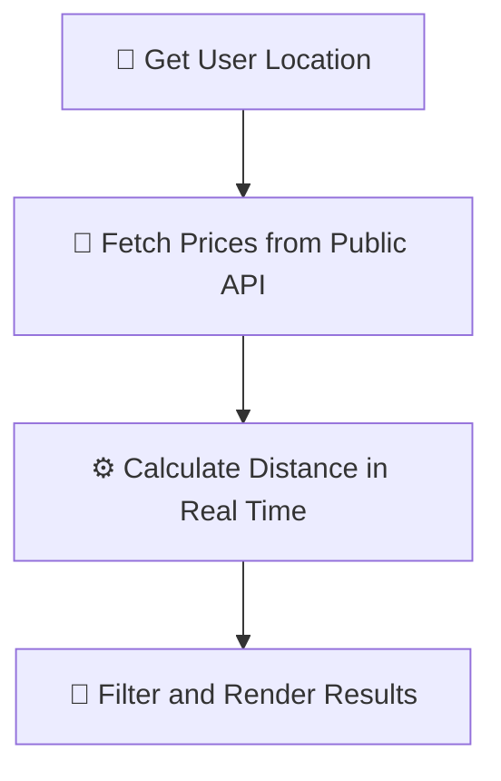

# ⛽ Fuelier

Read in: [🇪🇸 Español](translations/es/README.md)

> **Find your ideal gas station.**

Fuelier is a modern, fast, single-page web application (SPA) designed to help you locate the cheapest and closest gas stations in real-time based on your current location. It is fully optimized to be deployed on **GitHub Pages**.

---

## ⚡ Philosophy: Vibe Coding 🎵

This project has been developed 100% under the **Vibe Coding** philosophy. Rather than getting bogged down in over-engineering or rigid architectures from the start, we programmed through intuition and creative flow, leveraging Artificial Intelligence as a high-speed development co-pilot. This allowed us to focus on what truly matters: user experience, smooth micro-interactions, development rhythm, and premium aesthetics.

---

## ✨ Key Features

*   **📍 Instant Geolocation:** Find nearby service stations around you with just a single click.
*   **📡 Real-Time Prices:** Direct and smooth connection to the official Ministry of Industry API of Spain to fetch up-to-the-minute fuel prices.
*   **💶 Smart Filters:**
    *   Select your fuel type (Gasoline 95, Diesel).
    *   Set the maximum distance you want to travel.
    *   Filter by your maximum budget.
*   **↕️ Flexible Sorting:** Sort results by price (cheapest first) or by distance in kilometers.
*   **🗺️ Multi-Platform Navigation:** Direct links to navigate to the chosen station using **Google Maps**, **Waze**, or **Apple Maps**.
*   **📱 Premium & Interactive Design:** A fully responsive user interface tailored for mobile devices and desktops, featuring smooth transitions and custom premium select dropdowns.

---

## 🛠️ How It Works Under the Hood

Fuelier runs 100% in the user's browser securely and fast, following three simple steps:



1.  **Geolocation:** The browser detects your coordinates (latitude and longitude) with your prior permission.
2.  **Download:** It fetches real-time pricing data for all gas stations in Spain via the official REST API.
3.  **Client-Side Calculation:** Using the *Haversine* mathematical formula, it instantly calculates the exact distance in kilometers from your position to each service station, showing you only the most relevant ones.

---

## 🚀 How to Get Started

### 🌐 Directly on the Web
You can use the application instantly by visiting the official production version hosted on GitHub Pages:
👉 **[mrtech0.github.io/fuelier/](https://mrtech0.github.io/fuelier/)**

### 💻 Locally (Cloning the repository)
If you want to run or modify the project on your local machine:

1.  **Clone** this repository to your computer:
    ```bash
    git clone https://github.com/mrtech0/fuelier.git
    ```
2.  Navigate to the project folder.
3.  Open the **`index.html`** file by double-clicking it in your file explorer or launching a lightweight local server.
4.  That's it! You're ready to find the most cost-effective gas stations.

---

## 📁 Project Structure

*   `index.html` - Structured, accessible visual interface.
*   `app.js` - Logic for distance calculation, custom filters, and API fetching.
*   `styles.css` - Premium design system featuring modern fonts, clean colors, and mobile responsiveness.
*   `assets/` - Navigation icons and assets (Google Maps, Waze, Apple Maps).
