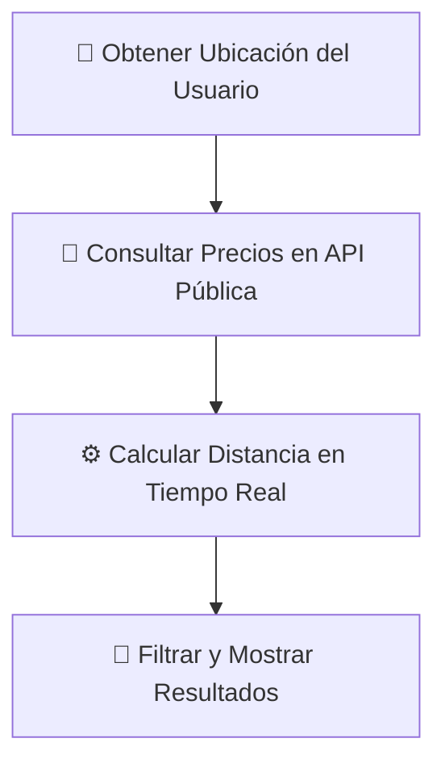

# ⛽ Fuelier

Leer en: [🇬🇧 English](../../README.md)

> **Encuentra tu gasolinera ideal.**

Fuelier es una aplicación web moderna, rápida y de una sola página (SPA) diseñada para ayudarte a localizar las gasolineras más baratas y cercanas en tiempo real a partir de tu ubicación actual. Está optimizada para su despliegue en **GitHub Pages**.

---

## ⚡ Filosofía: Vibe Coding 🎵

Este proyecto ha sido desarrollado siguiendo al 100% la filosofía del **Vibe Coding**. En lugar de enredarse en arquitecturas complejas desde el inicio, programamos a través de la intuición y el flujo creativo, utilizando la Inteligencia Artificial como un copiloto de desarrollo ágil. Esto nos permite centrarnos en lo que realmente importa: la experiencia de usuario, las microinteracciones fluidas, el ritmo del desarrollo y la estética premium.

---

## ✨ Características Principales

*   **📍 Geolocalización Instantánea:** Encuentra estaciones de servicio a tu alrededor con solo un clic.
*   **📡 Precios en Tiempo Real:** Conexión directa y fluida con la API oficial del Ministerio de Industria de España para obtener precios actualizados al minuto.
*   **💶 Filtros Inteligentes:**
    *   Selecciona tu tipo de combustible (Gasolina 95, Diésel).
    *   Establece la distancia máxima que deseas recorrer.
    *   Filtra por tu presupuesto máximo.
*   **↕️ Ordenación Flexible:** Ordena los resultados por precio (las más baratas primero) o por cercanía en kilómetros.
*   **🗺️ Navegación Multiplataforma:** Enlaces directos para guiarte hasta la estación usando **Google Maps**, **Waze** o **Apple Maps**.
*   **📱 Diseño Premium e Interactivo:** Una interfaz de usuario totalmente adaptable a móviles y ordenadores, con transiciones suaves y selectores premium personalizados.

---

## 🛠️ ¿Cómo funciona internamente?

Fuelier funciona al 100% en el navegador del usuario de forma rápida y segura mediante tres sencillos pasos:



1.  **Geolocalización:** El navegador detecta tus coordenadas (latitud y longitud) con tu permiso previo.
2.  **Descarga:** Descarga los datos de precios de todas las estaciones de servicio de España a través de un servicio web oficial.
3.  **Cálculo en Cliente:** Mediante la fórmula matemática de *Haversine*, calcula al instante y en tiempo real la distancia exacta en kilómetros desde tu posición a cada gasolinera, mostrándote solo las más óptimas.

---

## 🚀 Cómo Empezar a Usarlo

### 🌐 Directamente en la Web
Puedes usar la aplicación al instante visitando la versión oficial en producción alojada en GitHub Pages:
👉 **[mrtech0.github.io/fuelier/](https://mrtech0.github.io/fuelier/)**

### 💻 En Local (Clonando el repositorio)
Si deseas ejecutar o modificar el proyecto en tu máquina local:

1.  **Clona** este repositorio en tu ordenador:
    ```bash
    git clone https://github.com/mrtech0/fuelier.git
    ```
2.  Entra en la carpeta del proyecto.
3.  Abre el archivo **`index.html`** haciendo doble clic sobre él en tu explorador de archivos o levantando un servidor local ligero.
4.  ¡Listo! Ya puedes empezar a buscar las gasolineras más convenientes para tu bolsillo.

---

## 📁 Estructura del Proyecto

*   `index.html` - La interfaz visual estructurada y accesible.
*   `app.js` - Toda la lógica del cálculo de distancias, filtros y llamadas a la API.
*   `styles.css` - Sistema de diseño premium con tipografías modernas, colores limpios y adaptabilidad para móviles.
*   `assets/` - Logotipos e iconos de navegación (Google Maps, Waze, Apple Maps).
